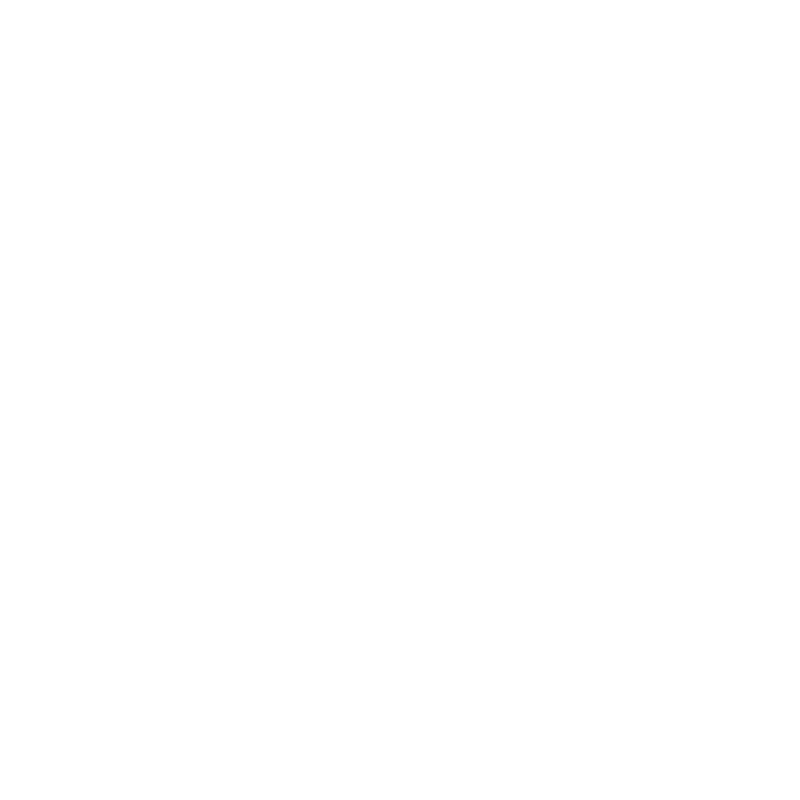

# RSP - Raeptor String Pattern

<!-- markdownlint-disable MD033 -->

    
      
    <strong>RSP (Raeptor String Pattern)</strong> is a regex-based pattern matching
     library designed for lexical analysis within the Raeptor Compiler-Compiler (RCC) ecosystem.
      

<!-- markdownlint-enable MD033 -->

## RSP Overview

**RSP** is a regex-based pattern matching library built for **RCC (Raeptor Compiler-Compiler)** lexers. It provides an intuitive syntax for defining and matching string patterns, enabling developers to build efficient lexical analyzers with minimal code.

## Features

- Intuitive regex pattern definition syntax
- Support for complex pattern matching and tokenization
- Optimized for lexical analysis in compiler development

## License

RSP is licensed under the MIT License.
See the [LICENSE](LICENSE.txt) file for more information.
